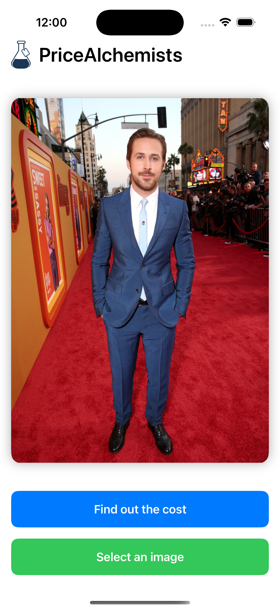
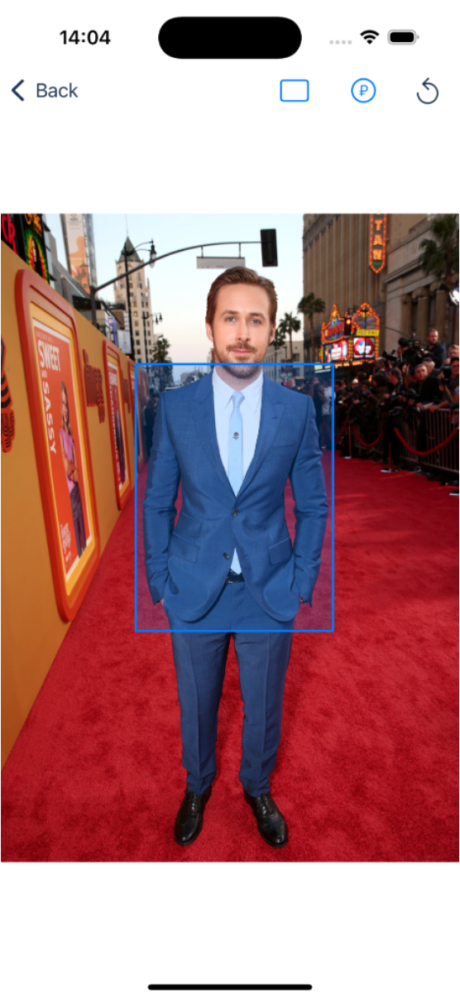
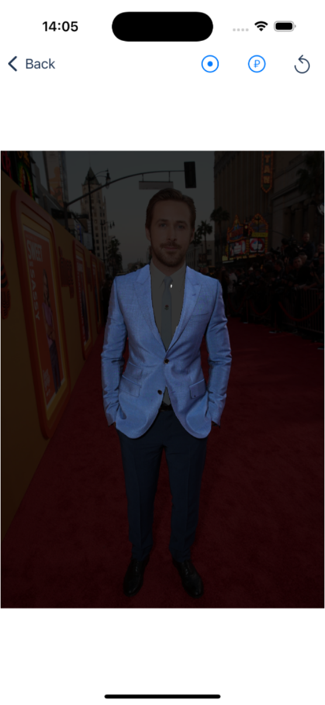
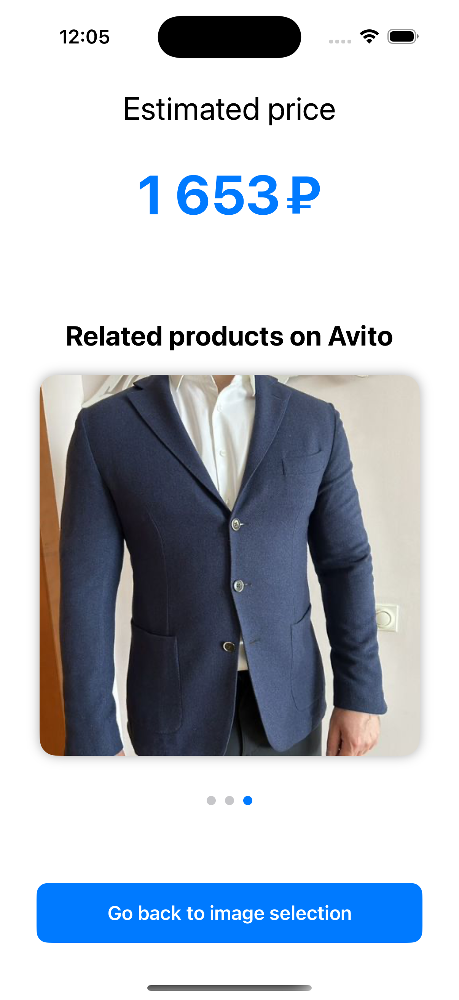

# 📸 PriceAlchemists

An academic project developed as the final assignment of the **Avito Analysts Academy** (Data Science track).

## 🔍 What is PriceAlchemists?

**PriceAlchemists** is a smart camera web application that helps users estimate the price of real-world objects based on a photo.

Imagine walking past a stylish pair of shoes or seeing a fancy gadget in someone’s apartment — just snap a photo, select the item, and get:

- 💰 A price estimate
- 🛍 Top-3 similar products on **Avito**

## 🎯 User Flow

### 1. Upload a Photo  
Choose an image from your gallery — the app will display it instantly.

  

---

### 2. Select an Object  
Click on the object you want to evaluate or select it in a rectangle. The application will automatically highlight it using intelligent segmentation.

  
  

---

### 3. Get the Price and see similar listings
After selecting an object, the app shows the estimated price for it and the top 3 similar products from **Avito**, helping users compare and take action.

  

## 💡 Why this app?

### Problem 1  
People hesitate to sell things online because they’re unsure about pricing.  
🛠 **Our solution**: Help users confidently price their items and list them in seconds.

### Problem 2  
Searching for items by image is often tedious and imprecise.  
🛠 **Our solution**: Simple object selection + platform-specific results (Avito).

## 👥 Team

- Kirill Katsuba  
- Ivan Popravka  
- Igor Mozolin  
- Sergey Umnov _(Team Lead)_
