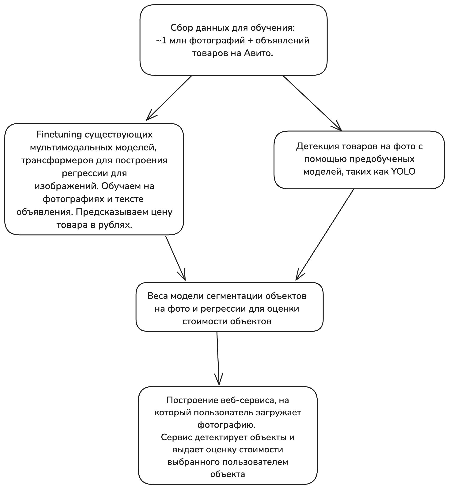

# Оценка проекта до взятия в работу

## Оценить потенциал проекта. Насколько важно решить задачу? 

### Проблема
- Пользователи часто видят на Авито привлекательные товары, но не понимают — цена занижена, завышена или соответствует рынку. Особенно это актуально для категорий с высокой вариативностью (мебель, электроника, одежда, техника, авто, коллекционные вещи и др.).
- При загрузке объявления продавцы иногда ошибаются или манипулируют ценой, что мешает покупателям и снижает доверие к платформе.
- Пользователь может не знать рыночную стоимость товара, который у него есть.

### Оценка масштаба проблемы
- В месяц на Авито публикуется более 5 млн новых объявлений, из них большая часть — с изображениями.
- Примерно 60–70% пользователей совершают покупки, ориентируясь в первую очередь на фото.
- Часть объявлений имеют нетипично низкие или высокие цены, что может быть связано с:
    - ошибками в цене (например, 999₽ за iPhone 14)
    - намеренными манипуляциями для повышения видимости
    - неадекватной самооценкой предмета (особенно у частных продавцов)

### Экономический эффект от внедрения
- **Рост конверсии просмотров в сделки**

    Релевантная подсказка пользователю «Ориентировочная цена — 12,000₽» увеличивает доверие → выше вероятность покупки.
    Даже +1% к конверсии может дать:
    - +50,000 сделок/мес
    - при среднем чеке в 7,000₽ — это +350 млн ₽ GMV (Общий объём оборота товаров) ежемесячно

- **Снижение мошенничества и возвратов**

    - Модель может выделять подозрительно заниженные или завышенные цены и подсказывать модерации.
    - Потенциал — уменьшение случаев с заведомо ложной ценой, что уменьшает негативный опыт и жалобы.

- **Поддержка автозаполнения цены при публикации объявления**

    Продавцу будет проще указать релевантную цену, что:
    - упрощает подачу
    - ускоряет модерацию

### Итого
- Проект имеет высокий потенциал влияния на основные метрики платформы: GMV, conversion rate, user trust.
- Может привести к росту выручки на ряде категорий, особенно при фильтрации аномалий.
- Решение важно для пользовательского опыта, как покупателей, так и продавцов — помогает ориентироваться в реальной стоимости и принимать решение быстрее.

## Есть ли простое решение? Насколько оно решит задачу? Сложно ли поддерживать такое решение?
В нашей задачи применимы два простых решений:

**Решение с помощью эмбеддингов изображений**

Для начала нужно взять имеющиеся объявления, получить их векторные представления и сохранить все это в базе данных. Затем, при поступлении изображения (уже после сегментации или детекции объекта) мы получаем его эмбеддинг. С помощью FAISS мы можем сделать быстрый поиск 
ближайших векторных представлений по базе данных, затем усреднить стоимость k ближайших объектов. Это и будет финальной стоимостью товара.

Это решение обладает очень быстрой скоростью: нам нужно только один раз посчитать эмбеддинги изображений из базы данных, а затем на инференсе
нужно лишь посчитать эмбединг нашего изображения и найти ближайшие.

Точность получаемого решения может быть неплохой, но слишком сильно зависит от хранимой информации: цены в базе данных могут устаревать, а 
также могут появляться новые виды товаров. В таком случае нужно правильно продумать обновление эмбеддингов изображений в базе данных, а также какие именно данные мы будем использовать для этого.

**Решение с усреднением по категории**

В такой задаче нужно взять имеющиеся данные по товарам и определить среднюю стоимость товара для каждой категории. Затем на инференсе можно просто определять категорию товара и выдавать ее за ответ.

Это решение также обладает быстрой скоростью: нужно лишь иметь один классификатор, который будет на инференсе определять категорию.

Точность решения может очень сильно страдать: в категории цена может очень сильно варьироваться от самого товара. Также тут сохраняется проблема из прошлого решения: данные могут устаревать, придется постоянно поддерживать актуальные средние цены для каждой из категории.

## Реалистичность решения проблемы с помощью машинного обучения

Наша задача представляет собой задачу регрессии стоимости товара, что является достаточно распространенной задачей. Для оценки реалистичности решения с помощью ML нашей командой был проведен обзор существующих решений нашей или схожей задачи:

- **Chen et al. (Stanford, 2018) – проект “The Price is Right”**

  В этом проекте собирались данные по велосипедам и машинам (MSRP цены). Они сравнили линейные модели на HOG и CNN-признаках с глубокими CNN (VGG16 и собственная архитектура PriceNet). Глубокое обучение показало значительно лучшую точность (вплоть до 25% прироста точности классификации по сегментам)[[1]](https://cs229.stanford.edu/proj2017/final-reports/5237321.pdf#:~:text=and%20a%20baseline%20for%20price,in%20a%20variety%20of%20metrics). Они отметили, что простое отнесение товара к общей категории с последующим использованием средней цены этой категории (как в ранней работе ClickToPrice) не подходит для точной оценки. [[2]](https://cs229.stanford.edu/proj2017/final-reports/5237321.pdf#:~:text=ClickToPrice%20,Our)

- **Maurya (INFORMS, 2016) – ClickToPrice**

    Одна из первых работ, которая пыталась использовать изображение для оценки цены. Модель Maurya сначала классифицировала товар на широкий класс (например, «полотенце», «туфли»), а затем присваивала среднюю цену по этому классу[[1]](https://cs229.stanford.edu/proj2017/final-reports/5237321.pdf#:~:text=ClickToPrice%20,Our). Авторы “Price is Right” справедливо раскритиковали этот подход, т.к. он игнорирует внутри-категорийные различия и фактически сведён к задачe классификации, не решая задачу тонкой регрессии стоимости.[[2]](https://cs229.stanford.edu/proj2017/final-reports/5237321.pdf#:~:text=However%2C%20,Our)

- **Warner et al. (Berkeley, 2017) – “Rate Against the Machine”**

    Они собрали большой датасет изображений картин и украшений с сайта Etsy (с ценами, заданными продавцами) и построили модель, комбинирующую визуальные и текстовые признаки. Для изображения использовалась CNN (AlexNet), адаптированная под регрессию цен через предсказание ценового интервала + сдвига[[1]](https://jeremywrnr.com/papers/rate-against-the-machine.pdf#:~:text=The%20AlexNet%20,center%20of%20the%20price%20interval), а текстовое описание обрабатывалось LSTM. Затем объединённые признаки проходили через Random Forest для финального прогноза цены[[2]](https://jeremywrnr.com/papers/rate-against-the-machine.pdf#:~:text=images%20scraped%20from%20Etsy%2C%20we,offer%20on%20Etsy%2C%20or%20simply). Интеграция описания значительно помогла учесть материалы, автора и другие детали. Итоговая точность классификации ценовых диапазонов достигла ~81.6%[[3]](https://jeremywrnr.com/papers/rate-against-the-machine.pdf#:~:text=images%20scraped%20from%20Etsy%2C%20we,offer%20on%20Etsy%2C%20or%20simply). Также авторы сделали веб-сервис, возвращающий оценку и находящий похожие товары в базе для справки[[4]](https://jeremywrnr.com/papers/rate-against-the-machine.pdf#:~:text=architecture%20and%20a%20Random%20Forest,the%20validity%20of%20the%20prediction).

- **Fathalla et al. (2020) – Deep end-to-end learning for price prediction of second-hand items.**

    Исследование специально нацелено на объявления б/у товаров в разных категориях (по сути, задача как у нас). Они предложили многоуровневую модель: CNN + LSTM для совмещения изображения и текстового описания, выдающую сразу минимальную, максимальную и предполагаемую цену товара​[[1]](https://colab.ws/articles/10.1007%2Fs10115-020-01495-8#:~:text=advertisements%20for%20the%20same%20product,hand). Дополнительно вводилась оценка качества состояния товара, которую модель пыталась предсказать и учесть при ценнике[[2]](https://colab.ws/articles/10.1007%2Fs10115-020-01495-8#:~:text=First%2C%20we%20propose%20forecasting%20the,in%20all%20of%20the%20used). Идея в том, что у одинаковых товаров есть диапазон цен на рынке (min–max), а конкретный экземпляр позиционируется в этом диапазоне в зависимости от состояния. Их подход позволил превзойти несколько бенчмарков (SVR, простые нейросети) по MAE с заметным отрывом[[3]](https://colab.ws/articles/10.1007%2Fs10115-020-01495-8#:~:text=quality%20score,in%20all%20of%20the%20used). Этот результат особенно релевантен, т.к. они решали мульти-категорийную задачу: одним модельным ансамблем покрыли электронику, мебель и пр., добившись универсальности.

- **You et al. (ACM MM, 2016) – «Image Based Appraisal of Real Estate»**

    Модель для оценки цен недвижимости по фотографиям дома. Здесь каждая «продажа» имеет несколько изображений (интерьер, экстерьер) – они обучили рекуррентную нейросеть (RNN), которая по очереди обрабатывает визуальные признаки от CNN для каждого фото и агрегирует их, предсказывая итоговую цену дома. Такой подход побил предыдущие методы оценки недвижимости по MAE и MAPE метрикам​[[1]](https://www.researchgate.net/publication/324150897_The_Price_is_Right_Predicting_Prices_with_Product_Images#:~:text=data,MAPE). Это показывает, как последовательная модель может объединять информацию с нескольких изображений. Хотя недвижимость – специфичная область, приемы (combining multiple images, использование сегментации сцен) применимы и к нам, если вдруг в объявлении много снимков товара.

На 2024–2025 годы продолжают появляться улучшения – например, гибридные ансамбли моделей для цен онлайн-товаров (Diwei Zhu et al. 2024), специальные модели для оценki автомобилей по фото и т.д. Но в целом, best practice складывается из комбинации: мощные эмбеддинги изображений (CNN/ViT, обученные на больших данных), плюс использование любой доступной дополнительной информации (категория, текст описания, исторические цены) в единой модели.

# Схема решения и метрики
## Решение с примером использования.
Сервис будет работать по следующему шаблону:
- Шаг 1. Пользователь загружает фото через веб-интерфейс (либо как дополнение к работе, помимо веб-интерфейса будет реализовано приложение на телефон).
- Шаг 2. Модель детектирует все объекты на фото на сервере. При нажатии на конкретный объекта на фото модель будет детектировать именно этот объект и для него будет показываться цена. (например, телефон, ноутбук, одежда).
- Шаг 3. Для каждого объекта модель оценивает цену на основе данных Avito (обучение будет происходить на данных из определенных сегментов Avito, таким образом за счет меньшего покрытия будет обеспечена большая точность работы модели).

**Пример:** Пользователь загружает фото с несколькими атрибутами одежда. Модель детектирует джинсы, обувь и майку и при нажатии на определенный объект модель будет его детектировать и показывать его цену.

## Общая архитектура нашего решения
1. **Веб-сервер (FastAPI/Flask)** для приема запросов.
2. **Обнаружение объектов (YOLOv8/EfficientDet)** — выделение регионов с объектами.
3. **Генерация объявления / описания объекта** для определния цены объекта
4. **Предсказание цены (CNN + регрессия, ViT, мультимодальные модели)** — оценка стоимости для каждого объекта основываясь на фото объекта и сгенерированном тексте объявления / описания объекта.
4. **Оптимизация**:
    - Использование GPU для инференса.
5. **Работа с видео (*):**
    - Обработка кадров асинхронно (FFmpeg + батчинг).

Диаграмма общей архитектуры нашего решения:

## Какая бизнес-метрика должна оптимизироваться? Какое её значение будет считаться успехом?

**Цель:**

Обеспечить пользователям точные и полезные оценки цен на небольшом списке категорий товаров.

**Успех:**
- ≥85% оценок отклоняются от реальных цен (на Avito) не более чем на 25%.
- ≤5% оценок имеют отклонение >50%.
- Время ответа <1 сек при нагрузке 1 RPS (при работе в веб-интерфейсе, инференс происходит на удаленном сервере).

**Обоснование:** 

Баланс между точностью и скоростью. Пользователи ожидают быстрого ответа, но значительные ошибки снизят доверие. Пользователи не смогут передать фотографии некоторых сегментов товаров на веб-сервис, но в противовес этому, модель будет иметь более высокую точность на тех сегментах, которые присутствовали в обучении.

## Какая метрика машинного обучения будет наилучшим образом отражать оптимизацию бизнес-метрики?
- **Основная метрика:** Mean Absolute Percentage Error (MAPE) — минимизация средней ошибки в процентах. Mean Average Error (MAE) - средняя относительная ошибка, хорошо интерпретируемая метрика, которая показывает среднее отклонение от цены товара в рублях.
- **Дополнительные метрики:**
    - Доля предсказаний с ошибкой ≤25% (цель — максимизация).
    - Доля предсказаний с ошибкой >50% (цель — минимизация).
- **Для детекции объектов:** mAP@0.5 (mean Average Precision при IoU=0.5) оценка точности локализации объектов.